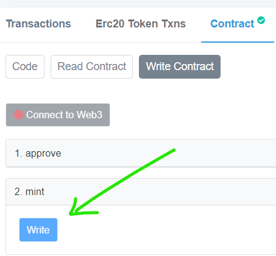
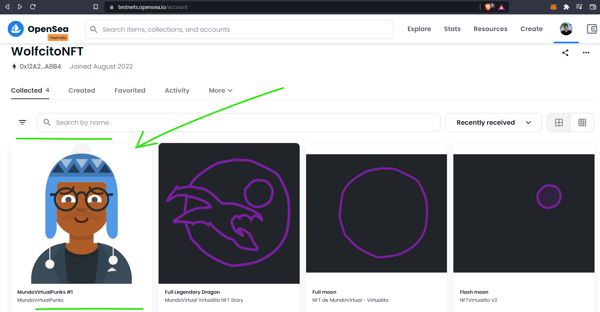

# MundoVirtual Solutions Hardhat Project

🐺It's raised in the testnet of Rinkeby 😬, whether you want mintify a NFT.

You can see this smart contract running here!
👉🏼 https://rinkeby.etherscan.io/address/0x234fDB0cFD406f8659B862B52D204BC7415e6f04#writeContract

Choose option 2: mint > write


y para visualizarlo se recomienda usar
👉🏼 https://testnets.opensea.io/


You can find the source here
👉🏼 https://github.com/guffenix/mundovirtual-nfts-hardhat

Raise a Hardhat enviroment.

Then clone this repo

Try running some of the following tasks:

```shell
npx hardhat help
npx hardhat test
GAS_REPORT=true npx hardhat test
npx hardhat node
npx hardhat run scripts/deploy.ts
```
